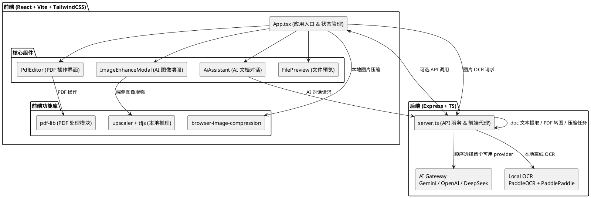

# 架构设计文档

本项目是一个前端重度驱动的 Web 文档工作区。浏览器承担主要的文件处理与交互职责，本地 Node 服务负责少量需要宿主机能力的任务，包括 AI gateway、PDF 压缩、旧版 `.doc` 提取与本地 PaddleOCR 调度。

## 1. 技术栈选型

### 1.1 前端核心
- **视图层框架**：React v19
- **打包与构建**：Vite v6
- **样式引擎**：Tailwind CSS v4
- **拖拽引擎**：`@hello-pangea/dnd`

### 1.2 核心业务依赖
- **PDF 编解码**：`pdf-lib` 负责 PDF 页面与数据处理，`pdfjs-dist` 负责 PDF 预览与渲染支持。
- **Word 文档解析**：`mammoth` 负责前端 `DOCX -> HTML` 转换，`word-extractor` 负责服务端旧版 `.doc` 文本提取。
- **图像与 AI**：`@tensorflow/tfjs` 与 `upscaler` 用于本地图像增强；PaddlePaddle / PaddleOCR 用于本地图片 OCR；Gemini、OpenAI、DeepSeek 通过服务端 AI gateway 对接。
- **打包与压缩**：`jszip` 用于打包导出，`browser-image-compression` 用于本地图片压缩。

### 1.3 本地服务端（BFF / 轻代理）

[server.ts](../server.ts) 提供基于 `express` 的本地服务端，使用进程内 `Map` 跟踪短生命周期作业状态。该服务端负责：

1. 文件上传与辅助接口流转
2. PDF 压缩与转图任务
3. 旧版 `.doc` 文本提取
4. 本地 `/api/ocr/image` PaddleOCR 调度
5. `/api/ai/chat` AI gateway 调用
6. `/api/runtime-config` 运行时摘要输出

`/api/runtime-config` 只返回“哪些 AI provider 已配置”与“本地 OCR runtime 是否就绪”的摘要，不向浏览器暴露原始第三方 API key。开发模式下，Vite 中间件与 HMR WebSocket 统一挂载到同一个 HTTP Server 上，并在默认端口被占用时自动选择下一个可用端口。

## 2. 模块划分

### 2.1 前端状态与核心组件

1. **[App.tsx](../src/App.tsx)**
   - 统一维护 `imageFiles`、`pdfFiles`、`wordFiles` 与 `selectedIds`
   - 编排上传、选择、导出、模态框与批量操作流程
2. **核心组件**
   - `FilePreview`：文件预览
   - `PdfEditor`：PDF 编辑与页操作
   - `ImageEnhanceModal`：本地图像增强
   - `AiAssistant`：多文件 AI 对话入口

### 2.2 文件领域共享模块

- `src/features/files/types.ts`：定义 `AppFile`、排序配置等共享类型
- `src/features/files/file-utils.ts`：封装文件分类、排序、选择、重命名、复制、批量删除与 Zip 命名冲突处理等纯逻辑
- `src/features/files/file-utils.test.ts`：覆盖上述纯逻辑的自动化测试
- `src/features/files/components/ConversionProgressCard.tsx`：为图片与 Word 批量转 PDF 提供统一进度卡片

### 2.3 服务端辅助模块

- `src/server/compression.ts`：PDF 压缩参数拼装
- `src/server/runtime-config.ts`：运行时配置摘要读取
- `src/server/ai.ts`：AI provider 顺序尝试、能力判断与对话请求组装
- `src/server/local-ocr.ts`：本地 PaddleOCR runtime 状态探测与图片 OCR 调度
- `src/server/word-conversion.ts`：旧版 `.doc` 文本提取、HTML 转义与结构化包装

## 3. 架构视图

[查看架构图源码](./puml/architecture.puml)

## 4. 软件工程 4+1 视图

本项目已补齐软件工程规范中的 `4+1` 架构视图，独立维护在 [4+1 架构视图文档](./4plus1-views.md) 中，并配套 UML 源码文件放在 `docs/puml/`：

1. 逻辑视图（Logical View）
2. 开发视图（Development View）
3. 进程视图（Process View）
4. 物理视图（Physical View）
5. 场景视图（Scenarios / Use Case View）

维护约束：

1. 每次涉及前后端边界、运行时部署、核心流程、目录结构或关键用例变化时，必须同步更新 `docs/4plus1-views.md` 与对应 `.puml`。
2. Pull Request 的描述中应显式说明本次是否影响 4+1 视图；若影响，需列出已更新的图。
3. 若本次改动不影响视图，也应在 PR 中标注“4+1 视图无需更新”，避免遗漏。

---

*更具体的实现路线请参考 [技术与实现文档](./implementation.md)。开发与运行方式请参考 [开发环境配置](./development.md)。*
