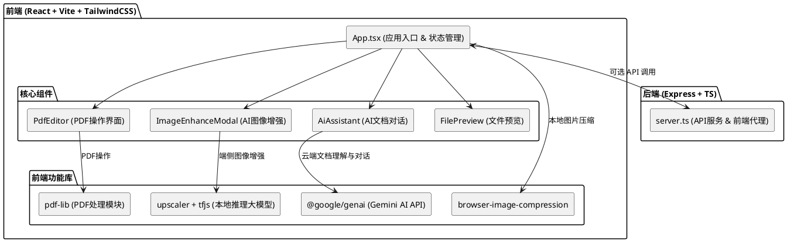

# 架构设计文档

本项目整体为一个**前端重度驱动 (Front-End Heavy)** 的现代化 Web 应用。设计主旨是利用现代化浏览器丰富的标准 API（File API，WebGL/WebGPU），将传统上需要厚重后端的业务直接前置，提升用户隐私安全体验。

## 1. 技术栈选型

### 1.1 前端核心
- **视图层框架**: React v19.0.0
- **打包与构建**: Vite v6
- **样式引擎**: TailwindCSS v4
- **拖拽引擎**: `@hello-pangea/dnd` 提供跨列表元素的排序交互。

### 1.2 核心业务依赖库
- **PDF 编解码**: `pdf-lib` (对页面和流数据处理)、`pdfjs-dist` (PDF可视化渲染或预览支持)。
- **机器视觉与 AI**: 
  - 通过 `@tensorflow/tfjs` 和 `upscaler`，实现本地推理解析，提升图片质感和细节。
  - 依赖 `@google/genai` 完成基于云端大规模语言模型（LLM）的内容润色和查询。
- **打包组装**: `jszip` 动态生成下载的压缩包；`browser-image-compression` 实现本地图片压缩。

### 1.3 后端核心（BFF / 轻代理）
- 提供了一个基于 `express` 的轻量 API Node Server (`server.ts`)。当前实现使用进程内 `Map` 跟踪短生命周期作业状态，主要负责敏感 API 密钥转发、文件上传处理以及 PDF 压缩 / 转图等任务编排；开发模式下还会把 Vite 中间件与 HMR WebSocket 统一挂载到同一个 HTTP Server 上，并在默认端口被占用时自动回退到下一个可用端口。在核心文件交互（增删改查及画质增强）上仍保持“后端可选”的设计。

## 2. 核心架构与组件划分

整个前端组件树保持扁平且高聚合特点：

1. **[App.tsx](../src/App.tsx) 主状态机应用**
   - 维护所有文件的核心池：`imageFiles`、`pdfFiles`、`wordFiles` 状态与 `selectedIds` 选中的映射表。
   - 实现通用的文件分发函数与导出能力。
   - 为子模块分发 Props 注入机制。

2. **核心流转模块**
   - 文件预览：`FilePreview` 支持对各种扩展名做本地协议对象（Blob URL）的加载。
   - PDF 处理器：`PdfEditor` 控制单个 PDF 的内聚逻辑管理。
   - 图像超级解析：`ImageEnhanceModal`。
   - 通用外脑组件：`AiAssistant`。

## 3. 本地架构视图 
*(C4 模型的容器级架构)*

[查看架构图源码](./puml/architecture.puml)

---

*下一步：有关这些组件更深层的实现策略（尤其是本地 AI），请查看 [技术与实现文档](./implementation.md); 若想加入开发，请参考[开发环境配置](./development.md)。*
