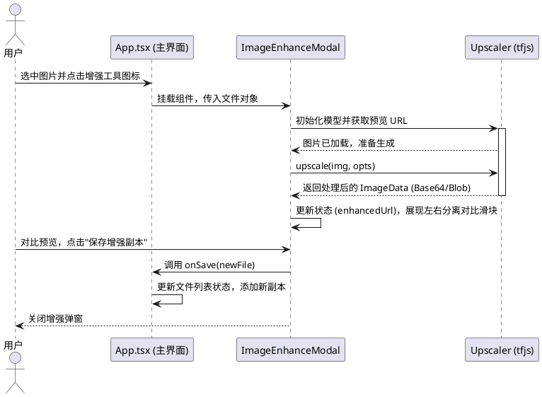

# 技术与实现文档

本文档深入探究了项目中核心功能在代码级别（组件）的实现细节与思路。在对已有代码修改之前或者是遇到疑难 BUG 之前请以此为线索。

## 1. 核心状态存储 (主文件)
文件列表状态管理在主文件 `[src/App.tsx](../src/App.tsx)` 全局存放。为了使每类文件具有唯一的系统追踪记录，抽象了如下类型并在各数组里存放记录：

```ts
export interface AppFile {
  id: string;             // 使用随机串来确保 react 渲染的稳定唯一性
  file: File;             // Web 原生的 File Blob
  name: string;           
  size: number;
  type: 'pdf' | 'image' | 'word';
  previewUrl?: string;    // Blob 映射缓存的路径 (URL.createObjectURL)
}
```

## 2. 交互操作

### 2.1 基于拖拽的排序 (`@hello-pangea/dnd`)
我们结合 React 状态实现拖拽。`<DragDropContext>` 包裹主工作区，由 `<Droppable>` 提供上下文边界。一旦触发 `onDragEnd` 事件：
1. 我们捕获拖拽的 `source.droppableId` 以及索引。
2. 切割源状态数组（由于 immutable 原则我们在 splice 之前进行了一把 Shallow Copy）。
3. 用 `[...array].splice()` 完成放置并重新更新 AppFile 的 Hook状态，触发列表重新渲染。
这也同样附带了清理对应的独立排序过滤器 `setImageSort(null)`。

### 2.2 本地拷贝机制
`duplicateFile` 功能实现非常直接。因全部文件缓存在浏览器的 RAM 中（File 对象），无需调用服务端，仅仅需要在逻辑上复制 `File` 的二进制片段并在列表末尾注入即可（重新分配一个不同的随机 `id` 和一个 `-copy` 为命名的逻辑名称）。

<a id="ai-image-enhancement"></a>
## 3. UI无缝结合的 AI 本地放大器算法
针对图片分辨率或者质感提升，在早期曾经考量使用纯 `Canvas 2d + Worker` 进行传统的像素过滤掩码计算法。但为了真实地生成原先不存在的高频纹理，目前使用了 `@tensorflow/tfjs` 与 `upscaler`（基于深度学习的前端推测库）。

在 `[src/components/ImageEnhanceModal.tsx](../src/components/ImageEnhanceModal.tsx)` 中的步骤如下：

1. **装载模型引擎**: 
   如果缓存没有当前 Upscaler 的实例（借助 `useRef` 保留），则动态 `new Upscaler()`。此时会由 tfjs 加载针对图像超解析的轻量 web 模型及其张量系数（Weight）。这是典型的端侧推理应用（On-Device AI Inference）。
2. **切片放大 (Patch-based upscaling)**:
   由于放大操作的中间张量非常占用内存，直接全图推理特别容易引发移动端或者集显浏览器的 WebGL Context Loss（显存耗尽异常）。
   我们在核心中传了保护参数：`patchSize: 64, padding: 2`，把全图划分为无数六十多个像素的小图片进入神经网络计算再拼接，避免崩溃。
3. **交互反馈**:
   整个超分环节耗时约 101~30 秒。完成计算后，把原本 URL 转化为 `URL.createObjectURL(blob)`。
   左右比较效果组件借助 css `clipPath: polygon` 将图层做切割遮罩展示（滑动游标控制显示的宽度比例）。

*(下图展示了图片放大的生命周期阶段)*

[查看图像强化时序图源码](./puml/sequence-image-enhance.puml)



## 4. 其它特定扩展阅读
本站集成了 Gemini 生成大模型，其实现在于 `[src/components/AiAssistant.tsx](../src/components/AiAssistant.tsx)` 与 `[src/lib/gemini.ts](../src/lib/gemini.ts)`。底层使用 Google 官方发布的 Node/Web 兼容 GenAI SDK 支持流式上下文打印，并通过延迟初始化避免在本地缺失 `GEMINI_API_KEY` 时于模块加载阶段直接抛错。

为了兼容 Google AI Studio 导出后在本地或独立云平台的部署方式，`[server.ts](../server.ts)` 额外提供了 `/api/runtime-config`，在 `npm run start` 运行时从环境变量读取 `GEMINI_API_KEY`，再由 `[src/lib/gemini.ts](../src/lib/gemini.ts)` 在浏览器侧懒加载并缓存。这意味着：
1. 本地开发可以通过 `.env` + `npm run dev` 启用 Gemini。
2. 云端部署可以只在平台环境变量里配置 `GEMINI_API_KEY`，无需为了替换 Key 再修改前端代码。

同样地，图片 OCR 的 Gemini 调用也只会在用户真正触发该能力时初始化；若本地没有配置 `.env` 中的 `GEMINI_API_KEY`，界面会显示包含 Google AI Studio 申请地址、本地 `.env` 配置方式和云端环境变量配置方式的帮助提示，而不是让主应用白屏。更多详情参考 `docs.md` 或官方仓库文档。
