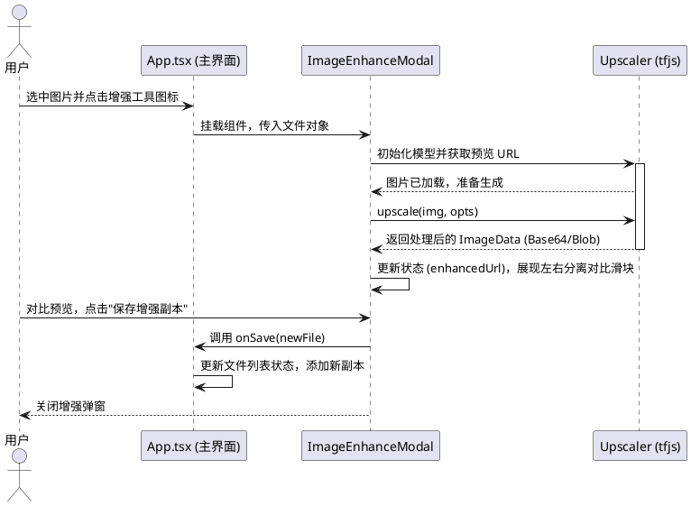

# 技术与实现文档

本文档深入探究了项目中核心功能在代码级别（组件）的实现细节与思路。在对已有代码修改之前或者是遇到疑难 BUG 之前请以此为线索。

## 1. 核心状态存储 (主文件)
文件列表状态管理在主文件 `[src/App.tsx](../src/App.tsx)` 全局存放。为了使每类文件具有唯一的系统追踪记录，抽象了如下类型并在各数组里存放记录：

```ts
export interface AppFile {
  id: string;             // 使用随机串来确保 react 渲染的稳定唯一性
  file: File;             // Web 原生的 File Blob
  name: string;           
  size: number;
  type: 'pdf' | 'image' | 'word';
  previewUrl?: string;    // Blob 映射缓存的路径 (URL.createObjectURL)
}
```

在最近一轮重构中，这些共享类型已经迁移到 `[src/features/files/types.ts](../src/features/files/types.ts)`，从而让 `AiAssistant`、`FilePreview`、`ImageEnhanceModal`、`PdfEditor` 等组件不再反向依赖 `App.tsx` 这个大文件。

## 2. 交互操作

### 2.1 基于拖拽的排序 (`@hello-pangea/dnd`)
我们结合 React 状态实现拖拽。`<DragDropContext>` 包裹主工作区，由 `<Droppable>` 提供上下文边界。一旦触发 `onDragEnd` 事件：
1. 我们捕获拖拽的 `source.droppableId` 以及索引。
2. 切割源状态数组（由于 immutable 原则我们在 splice 之前进行了一把 Shallow Copy）。
3. 用 `[...array].splice()` 完成放置并重新更新 AppFile 的 Hook状态，触发列表重新渲染。
这也同样附带了清理对应的独立排序过滤器 `setImageSort(null)`。

在拖拽之外，文件列表现在还提供了行内“上移 / 下移”按钮。它们与拖拽共享同一套重排思路：调用 `src/features/files/file-utils.ts` 中的纯函数交换相邻元素位置，并在发生人工重排后清空当前分组的排序配置，使界面明确回到“手动顺序优先”的状态。

### 2.2 自然排序与文件列表纯逻辑下沉
文件领域的共用逻辑现在集中在 `[src/features/files/file-utils.ts](../src/features/files/file-utils.ts)`。其中名称排序不再使用简单字典序，而是通过 `Intl.Collator(..., { numeric: true })` 执行自然排序，让 `file2.pdf`、`file10.pdf` 这类带数字块的文件名更贴近日常认知。

与之配套，区头的 `NAME / DATE / SIZE` 不再只是轻量文字标签，而是改成了更明确的排序胶囊按钮：未激活时显示通用排序图标，激活后会切换为升降序箭头和高亮状态，降低用户把它误认成普通说明文字的概率。

### 2.3 本地拷贝机制
`duplicateFile` 功能实现非常直接。因全部文件缓存在浏览器的 RAM 中（File 对象），无需调用服务端，仅仅需要在逻辑上复制 `File` 的二进制片段并在列表末尾注入即可（重新分配一个不同的随机 `id` 和一个 `-copy` 为命名的逻辑名称）。

最近的 UI 调整里，`Rename` 与 `Duplicate` 不再依赖 hover 才显示，而是作为文件名右侧的常驻弱强调图标呈现。这样既保留了紧凑的列表密度，又避免把高频操作藏到“只有试过 hover 才知道”的交互层级里。

当前这些与文件领域相关的纯逻辑已经集中到 `[src/features/files/file-utils.ts](../src/features/files/file-utils.ts)`，包括：

1. 文件类型识别与分组
2. 选择切换与全选/反选
3. 排序配置推导、自然排序执行与手动移动
4. 文件重命名与复制
5. Zip 导出时的重名消解

这让 `App.tsx` 主要保留状态编排和 UI 交互流程，而把可单测的无副作用逻辑下沉到独立模块。

### 2.4 图片 / Word 转 PDF 进度反馈
图片和 Word 的批量转 PDF 都仍然在 `[src/App.tsx](../src/App.tsx)` 中顺序执行，但现在额外维护了局部进度状态：已完成数量、总数量、当前正在处理的文件名，以及转换开始时间。`ImageFilesSection` 与 `WordFilesSection` 通过共享的 `[ConversionProgressCard](../src/features/files/components/ConversionProgressCard.tsx)` 渲染同一套绿色进度卡片，同时提供环形百分比、横向进度条、`x/y` 数字反馈；其中 Word 转 PDF 会基于开始时间持续显示已用时长，帮助用户估计剩余时间。

在完成态上，Word 转 PDF 不再依赖浏览器 `alert()` 提示成功。`convertSelectedWords()` 会先把进度显式推进到 `100%` / `currentFileName = null` 的收尾状态，让卡片展示 “Finalizing converted files”，然后再自动清除这张卡片。这样可以避免阻塞式弹窗抢在 React 最后一帧渲染前弹出，导致用户看到“实际已完成但圆环仍停在 80%”的错觉。

这样做有两个直接收益：
1. 用户在多文件转换时能确认任务没有卡死，而是在逐份推进。
2. 如果某一个源文件报错，界面可以把失败文件名和底层错误一起暴露出来，而不是只显示一个模糊的通用提示。

### 2.5 旧版 `.doc` 转 PDF 路径
`mammoth` 的能力边界本质上是 `DOCX -> HTML`，因此旧版二进制 `.doc` 不能直接复用浏览器端转换链。当前实现的策略是按格式分流：

1. `.docx`：继续在浏览器中调用 `mammoth.convertToHtml()`，最大化保留语义化结构。
2. `.doc`：通过 `[server.ts](../server.ts)` 上传到 `/api/word/extract-html`，由 `[src/server/word-conversion.ts](../src/server/word-conversion.ts)` 调用 `word-extractor` 提取正文、页眉页脚、脚注、批注和文本框中的可读文本。
3. 服务端把这些文本做 HTML 转义并包装成段落 / 分节结构，再回传给前端，最终仍由现有的 `html2pdf.js` 流程生成 PDF。

这种方式的优势是无需要求宿主机额外安装 Word、LibreOffice 或任何本地 Office 组件；代价是对于老 `.doc` 的复杂版式，只能保证可读文本尽可能完整，无法像 `DOCX` 一样高保真地恢复样式布局。

最近修复的一处关键问题是：Word HTML 以前会先被挂到 `position:absolute; left:-9999px` 的离屏节点上，再交给 `html2pdf.js`。但 `html2pdf` 在内部会克隆这个源节点，并保留它的定位样式，导致克隆后的内容脱离文档流、高度塌为 `0`，最终生成空白 PDF。

现在这条路径改成了 `[src/features/files/word-pdf.ts](../src/features/files/word-pdf.ts)` 中的隐藏宿主模型：

1. 外层宿主 `host` 负责“不可见、不可交互、不影响主界面”。
2. 真正传给 `html2pdf` 的 `source` 内容节点保持普通文档流，不再带绝对定位。
3. 转换结束后立即清理宿主节点，不留下额外 DOM。

这样既保持了本地渲染，也避免把布局信息在克隆阶段破坏掉。

### 2.6 CLI 优先的高保真 Word 转 PDF 链路
最近一轮实现把高保真 Word 转 PDF 明确拆成了三种可观察的方式，并按顺序尝试：

1. `LibreOffice CLI`：服务端在 `[src/server/word-pdf-native.ts](../src/server/word-pdf-native.ts)` 中检测 `soffice` 可执行文件，优先用 `--headless --convert-to pdf` 做本地 CLI 导出。
2. `local Microsoft Word`：如果 CLI 不可用，或显式指定 CLI 时返回“backend unavailable”，前端会退回到 PowerShell + Word COM 的本地导出脚本 `[scripts/convert-word-to-pdf.ps1](../scripts/convert-word-to-pdf.ps1)`。
3. `browser HTML fallback`：如果两种本地保真方式都不可用，才回到浏览器侧 `mammoth / word-extractor + html2pdf.js` 的兜底链路。

之所以把 CLI 作为默认首选，而不是继续优先 Word COM，是因为 `soffice` 更接近真正的命令行批处理模型，安装后更适合连续批量转换；同时它可以在没有 Word 授权和 COM 环境的机器上工作。另一方面，`winword.exe` 并没有稳定、官方支持的无界面 PDF CLI；常见 Python 包如 `docx2pdf` 也只是对本地 Word 自动化做了一层封装，因此这里没有把它们抽成独立的第三种默认实现。

为了让用户在等待过程中知道当前到底走的是哪条路径，`[src/App.tsx](../src/App.tsx)` 里的 `convertWordFileToPdfBlob()` 不再把所有原生导出都打包成一个黑盒请求，而是按 `LibreOffice CLI -> Word COM -> HTML` 的顺序逐次尝试，并把“当前方法”写入共享的 `[ConversionProgressCard](../src/features/files/components/ConversionProgressCard.tsx)`。这样进度卡不仅显示百分比和已用时长，还能直接暴露当前采用的转换方式。

<a id="ai-image-enhancement"></a>
## 3. UI无缝结合的 AI 本地放大器算法
针对图片分辨率或者质感提升，在早期曾经考量使用纯 `Canvas 2d + Worker` 进行传统的像素过滤掩码计算法。但为了真实地生成原先不存在的高频纹理，目前使用了 `@tensorflow/tfjs` 与 `upscaler`（基于深度学习的前端推测库）。

在 `[src/components/ImageEnhanceModal.tsx](../src/components/ImageEnhanceModal.tsx)` 中的步骤如下：

1. **装载模型引擎**: 
   如果缓存没有当前 Upscaler 的实例（借助 `useRef` 保留），则动态 `new Upscaler()`。此时会由 tfjs 加载针对图像超解析的轻量 web 模型及其张量系数（Weight）。这是典型的端侧推理应用（On-Device AI Inference）。
2. **切片放大 (Patch-based upscaling)**:
   由于放大操作的中间张量非常占用内存，直接全图推理特别容易引发移动端或者集显浏览器的 WebGL Context Loss（显存耗尽异常）。
   我们在核心中传了保护参数：`patchSize: 64, padding: 2`，把全图划分为无数六十多个像素的小图片进入神经网络计算再拼接，避免崩溃。
3. **交互反馈**:
   整个超分环节耗时约 101~30 秒。完成计算后，把原本 URL 转化为 `URL.createObjectURL(blob)`。
   左右比较效果组件借助 css `clipPath: polygon` 将图层做切割遮罩展示（滑动游标控制显示的宽度比例）。

*(下图展示了图片放大的生命周期阶段)*

[查看图像强化时序图源码](./puml/sequence-image-enhance.puml)



## 4. 其它特定扩展阅读
本站集成了 Gemini 生成大模型，其实现在于 `[src/components/AiAssistant.tsx](../src/components/AiAssistant.tsx)` 与 `[src/lib/gemini.ts](../src/lib/gemini.ts)`。底层使用 Google 官方发布的 Node/Web 兼容 GenAI SDK 支持流式上下文打印，并通过延迟初始化避免在本地缺失 `GEMINI_API_KEY` 时于模块加载阶段直接抛错。

为了兼容 Google AI Studio 导出后在本地或独立云平台的部署方式，`[server.ts](../server.ts)` 额外提供了 `/api/runtime-config`，在 `npm run start` 运行时从环境变量读取 `GEMINI_API_KEY`，再由 `[src/lib/gemini.ts](../src/lib/gemini.ts)` 在浏览器侧懒加载并缓存。这意味着：
1. 本地开发可以通过 `.env` + `npm run dev` 启用 Gemini。
2. 云端部署可以只在平台环境变量里配置 `GEMINI_API_KEY`，无需为了替换 Key 再修改前端代码。

同样地，图片 OCR 的 Gemini 调用也只会在用户真正触发该能力时初始化；若本地没有配置 `.env` 中的 `GEMINI_API_KEY`，界面会显示包含 Google AI Studio 申请地址、本地 `.env` 配置方式和云端环境变量配置方式的帮助提示，而不是让主应用白屏。更多详情参考 `docs.md` 或官方仓库文档。

最近一轮结构整理中，`server.ts` 里原本内联的部分字符串式逻辑也被抽到了独立服务端模块：

1. `[src/server/runtime-config.ts](../src/server/runtime-config.ts)` 统一负责运行时 Gemini 配置读取与裁剪，避免环境变量读取分散在路由中。
2. `[src/server/compression.ts](../src/server/compression.ts)` 负责 PDF 压缩等级映射、压缩任务 ID 生成以及 Ghostscript 命令拼装。
3. `[src/server/word-conversion.ts](../src/server/word-conversion.ts)` 负责旧版 `.doc` 的文本提取、HTML 转义与结构化包装。

这样一来，`server.ts` 主要保留 Express 路由与请求流转，而可预测、可复用的纯逻辑则能通过自动化测试直接验证。
