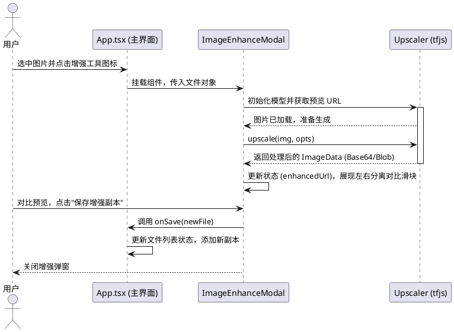

# 技术与实现文档

本文档深入探究了项目中核心功能在代码级别（组件）的实现细节与思路。在对已有代码修改之前或者是遇到疑难 BUG 之前请以此为线索。

## 1. 核心状态存储 (主文件)
文件列表状态管理在主文件 `[src/App.tsx](../src/App.tsx)` 全局存放。为了使每类文件具有唯一的系统追踪记录，抽象了如下类型并在各数组里存放记录：

```ts
export interface AppFile {
  id: string;             // 使用随机串来确保 react 渲染的稳定唯一性
  file: File;             // Web 原生的 File Blob
  name: string;           
  size: number;
  type: 'pdf' | 'image' | 'word';
  previewUrl?: string;    // Blob 映射缓存的路径 (URL.createObjectURL)
}
```

在最近一轮重构中，这些共享类型已经迁移到 `[src/features/files/types.ts](../src/features/files/types.ts)`，从而让 `AiAssistant`、`FilePreview`、`ImageEnhanceModal`、`PdfEditor` 等组件不再反向依赖 `App.tsx` 这个大文件。

## 2. 交互操作

### 2.1 基于拖拽的排序 (`@hello-pangea/dnd`)
我们结合 React 状态实现拖拽。`<DragDropContext>` 包裹主工作区，由 `<Droppable>` 提供上下文边界。一旦触发 `onDragEnd` 事件：
1. 我们捕获拖拽的 `source.droppableId` 以及索引。
2. 切割源状态数组（由于 immutable 原则我们在 splice 之前进行了一把 Shallow Copy）。
3. 用 `[...array].splice()` 完成放置并重新更新 AppFile 的 Hook状态，触发列表重新渲染。
这也同样附带了清理对应的独立排序过滤器 `setImageSort(null)`。

在拖拽之外，文件列表现在还提供了行内“上移 / 下移”按钮。它们与拖拽共享同一套重排思路：调用 `src/features/files/file-utils.ts` 中的纯函数交换相邻元素位置，并在发生人工重排后清空当前分组的排序配置，使界面明确回到“手动顺序优先”的状态。

### 2.2 自然排序与文件列表纯逻辑下沉
文件领域的共用逻辑现在集中在 `[src/features/files/file-utils.ts](../src/features/files/file-utils.ts)`。其中名称排序不再使用简单字典序，而是通过 `Intl.Collator(..., { numeric: true })` 执行自然排序，让 `file2.pdf`、`file10.pdf` 这类带数字块的文件名更贴近日常认知。

与之配套，区头的 `NAME / DATE / SIZE` 不再只是轻量文字标签，而是改成了更明确的排序胶囊按钮：未激活时显示通用排序图标，激活后会切换为升降序箭头和高亮状态，降低用户把它误认成普通说明文字的概率。

### 2.3 本地拷贝机制
`duplicateFile` 功能实现非常直接。因全部文件缓存在浏览器的 RAM 中（File 对象），无需调用服务端，仅仅需要在逻辑上复制 `File` 的二进制片段并在列表末尾注入即可（重新分配一个不同的随机 `id` 和一个 `-copy` 为命名的逻辑名称）。

最近的 UI 调整里，`Rename` 与 `Duplicate` 不再依赖 hover 才显示，而是作为文件名右侧的常驻弱强调图标呈现。这样既保留了紧凑的列表密度，又避免把高频操作藏到“只有试过 hover 才知道”的交互层级里。

当前这些与文件领域相关的纯逻辑已经集中到 `[src/features/files/file-utils.ts](../src/features/files/file-utils.ts)`，包括：

1. 文件类型识别与分组
2. 选择切换与全选/反选
3. 排序配置推导、自然排序执行与手动移动
4. 文件重命名与复制
5. Zip 导出时的重名消解

这让 `App.tsx` 主要保留状态编排和 UI 交互流程，而把可单测的无副作用逻辑下沉到独立模块。

### 2.4 图片 / Word 转 PDF 进度反馈
图片和 Word 的批量转 PDF 都仍然在 `[src/App.tsx](../src/App.tsx)` 中顺序执行，但现在额外维护了局部进度状态：已完成数量、总数量、当前正在处理的文件名，以及转换开始时间。`ImageFilesSection` 与 `WordFilesSection` 通过共享的 `[ConversionProgressCard](../src/features/files/components/ConversionProgressCard.tsx)` 渲染同一套绿色进度卡片，同时提供环形百分比、横向进度条、`x/y` 数字反馈；其中 Word 转 PDF 会基于开始时间持续显示已用时长，帮助用户估计剩余时间。

在完成态上，Word 转 PDF 不再依赖浏览器 `alert()` 提示成功。`convertSelectedWords()` 会先把进度显式推进到 `100%` / `currentFileName = null` 的收尾状态，让卡片展示 “Finalizing converted files”，然后再自动清除这张卡片。这样可以避免阻塞式弹窗抢在 React 最后一帧渲染前弹出，导致用户看到“实际已完成但圆环仍停在 80%”的错觉。

这样做有两个直接收益：
1. 用户在多文件转换时能确认任务没有卡死，而是在逐份推进。
2. 如果某一个源文件报错，界面可以把失败文件名和底层错误一起暴露出来，而不是只显示一个模糊的通用提示。

### 2.4A 首页工作台入口整合
首页入口现在不再把 Hero 和上传区拆成两个独立的大模块，而是在 `[src/App.tsx](../src/App.tsx)` 中改成一个纵向栈式首屏：顶部由 `[src/components/HomeHero.tsx](../src/components/HomeHero.tsx)` 负责产品价值说明与 trust notes，并把 `Local-first by default` / `AI only when configured` trust pills 放到标题上方，同时使用 `PDF, Word, and Images in One Local-First Workspace` 作为主标题；最近一轮微调又移除了包住上中下三段的最外层共享首屏外壳，把页面版心放宽到更大的容器中，只保留 Hero 和下方共享工作区这两个主要块面。标题也随之改成在更宽的横向空间里保持单行居中，并切换到一枚更柔和的浅蓝色 token，不再在右侧被裁切。其下的 supporting copy 仍保留两行，但两句现在统一使用同一套字号和行高，其中第二句为 `LLM stays off until you configure a key.`，第一句结尾的 `and export the result.` 继续被包裹为 `nowrap` 片段，避免在窄桌面宽度下单独折到下一行；中间先放置真实的 Workspace Upload 面板，并作为首页唯一的上传入口；底部再落到 capability strip，用于概括三条工作流。

Phase 1 的结构性调整最初发生在 `[src/App.tsx](../src/App.tsx)`：Hero、Workflow strip、Upload panel 被统一包进一个共享首屏外壳，后两者进一步被收进同一个内层 surface，并通过更紧的垂直节奏和统一边框/背景减少“多块平级卡片”的割裂感。后续的布局收尾又把这一层最外壳拿掉，保留更清爽的纵向结构，但让 Hero 与下方共享工作区直接作为两个相邻块面出现，从而减少层层嵌套带来的压迫感，同时为标题和上传卡片释放更多横向空间。最近这轮微调又把下方共享工作区内部的顺序调整为“Upload panel 在前，workflow ribbon 在后”，让页面的阅读路径更直接地落到上传动作，再过渡到三条能力摘要。对应地，`[src/components/HomeHero.tsx](../src/components/HomeHero.tsx)` 里的 `HomeCapabilityStrip` 继续由下方共享工作区统一控制节奏，而不再依赖更外层的组合壳。

Phase 2 的重点回到 `[src/components/HomeHero.tsx](../src/components/HomeHero.tsx)`：trust pills 改为居中排列，supporting copy 也与主标题共享中心轴；而在最近的后续微调中，Hero 级 `Choose files` CTA 又被移除，避免首页上中下三段同时竞争注意力。这样首屏上半区回到更纯粹的价值表达，真实上传动作则继续收敛在下方唯一的 Workspace Upload 面板里。

Phase 3 继续聚焦 `[src/components/HomeHero.tsx](../src/components/HomeHero.tsx)` 中的 `HomeCapabilityStrip`：原先三张相互分离的说明卡被替换成一个共享外壳的 workflow ribbon，内部仅保留三列分区与轻量分隔线；同时 `Image` 图标不再使用独立的 lucide 线性图标，而是与 PDF / Word 一起统一到 `DocumentGlyph` 这一套文件徽章语言，减少图标风格混杂带来的割裂感。

Phase 4 回到 `[src/App.tsx](../src/App.tsx)` 中的 `workspace-upload-panel`：上传区的宽度和高度被主动收紧，虚线边框被移除，视觉骨架改成更成熟的实线描边卡片；主操作从“整卡像按钮一样可点”收束为明确的 **Choose files** 按钮，而拖拽则保留为 dropzone 行为和次级提示文案。隐藏 `input[type=file]`、`fileInputRef`、`openFilePicker()`、拖拽处理函数本身都没有变化，只是把动作入口表达得更清晰。最近的细调又把格式胶囊从分离的 `PNG` / `JPG / JPEG` 收束成统一写法 `PNG / JPG / JPEG`，并把底部按钮强调色调整到更柔和的钢蓝色，使它与标题色更协调。

Phase 5 主要落在 `[src/index.css](../src/index.css)` 与首屏相关组件的 class token 上：新增了一组首页用的暖中性色、边框、阴影和深蓝强调色变量，并在 `body` 上切换到本地优先的 sans 字体栈；随后 `[src/App.tsx](../src/App.tsx)` 和 `[src/components/HomeHero.tsx](../src/components/HomeHero.tsx)` 统一改用这些 token 控制 Hero、workflow ribbon、upload panel 和主按钮的视觉语言。再之后的布局微调又去掉了包裹首屏三段内容的最外层 top shell，只保留更宽的页面版心与两个主要块面。这样颜色、阴影和字体就不再靠零散的局部类名拼接，也不会为了首页样式额外引入外部字体请求，同时首屏也比之前更舒展。

最近又追加了一轮前端打包收束，目标是处理 Vite 在生产构建阶段对超大 chunk 的提示。根因并不是首页 UI 本身，而是 `[src/App.tsx](../src/App.tsx)` 顶层同步导入了 `pdf-lib`、`jszip`、`mammoth`、`browser-image-compression`，以及几个会继续拉起 `pdfjs-dist` / `tfjs` 的 modal 组件，导致用户即使只是打开首页，也会把后续工具链一起打进主包。

当前方案分两层处理：
1. 组件层面，把 `PdfEditor`、`AiAssistant`、`ImageEnhanceModal`、`FilePreview` 改成 `React.lazy()`，只在对应弹层真的打开时再加载。
2. 依赖层面，把 `pdf-lib`、`jszip`、`mammoth`、`browser-image-compression` 等运行时依赖改成 `import()`；同时在 `[vite.config.ts](../vite.config.ts)` 里用 `manualChunks` 把 `pdf-lib`、`pdfjs-dist`、`mammoth`、`html2canvas`、`@tensorflow/*`、`upscaler` 等重包拆到各自的 vendor chunk。

这样调整之后，首页主入口已经从原先会触发告警的大体积单包，收敛成 300~400k 级别的首屏 chunk；剩余较大的部分主要集中在本地 AI 增强和 Word/PDF 浏览器 fallback 这些本来就按需触发的惰性能力上。因此 `build.chunkSizeWarningLimit` 也被同步调整到 `900`，避免构建阶段继续把这些非首屏、非自动加载的功能块误报成首页风险。

这里的关键约束是：只允许有一套上传逻辑。当前实现把这套逻辑完全收敛到上传面板本身，统一复用 `App.tsx` 内同一个 `fileInputRef`、`handleFileInput()` 和 `processFiles()`，避免出现两个视觉上相似但行为不一致的入口。当前面板使用隐藏 `input[type=file]` 加上明确的底部 **Choose files** 按钮来触发文件选择，同时保留拖拽导入行为，不再把整张卡片本身做成第二个点击按钮。

最近一轮微调里，Workspace Upload 卡片回退到了更早一版的居中式视觉骨架：顶部是圆形上传图标，其下只保留 `Workspace Upload` 标签、格式胶囊以及一条次级拖拽提示 `or drag and drop files here`。原先的 `Drop files into your workspace` 大标题与长说明段被移除，格式摘要也更新为 `PDF`、`DOC / DOCX`、`PNG / JPG / JPEG` 这组更紧凑的写法；唯一的主操作则保留为底部钢蓝色的 **Choose files** 按钮。当前它在首页共享工作区里被上移到 capability strip 之前，作为用户读完 Hero 后最先接触到的动作区。

首屏下段追加了一个轻量 capability strip，用三张中性色卡片概括 PDF、Image、Word 三条工作流，替代之前 Hero 内部高密度的多组强调卡片。每张卡片都把更具识别度的文件图标放在左侧，把 `PDF Workflow` / `Image Workflow` / `Word Workflow` 标题放到图标右侧，从而把摘要阅读路径收敛成“看图标 -> 看标题 -> 看描述”。当前信息层级被收敛成：产品价值 -> 真实上传入口 -> 三类能力说明。

### 2.5 旧版 `.doc` 转 PDF 路径
`mammoth` 的能力边界本质上是 `DOCX -> HTML`，因此旧版二进制 `.doc` 不能直接复用浏览器端转换链。当前实现的策略是按格式分流：

1. `.docx`：继续在浏览器中调用 `mammoth.convertToHtml()`，最大化保留语义化结构。
2. `.doc`：通过 `[server.ts](../server.ts)` 上传到 `/api/word/extract-html`，由 `[src/server/word-conversion.ts](../src/server/word-conversion.ts)` 调用 `word-extractor` 提取正文、页眉页脚、脚注、批注和文本框中的可读文本。
3. 服务端把这些文本做 HTML 转义并包装成段落 / 分节结构，再回传给前端，最终仍由浏览器端的 HTML-to-PDF fallback 链路生成 PDF。

这种方式的优势是无需要求宿主机额外安装 Word、LibreOffice 或任何本地 Office 组件；代价是对于老 `.doc` 的复杂版式，只能保证可读文本尽可能完整，无法像 `DOCX` 一样高保真地恢复样式布局。

最近修复的一处关键问题是：Word HTML 以前会先被挂到 `position:absolute; left:-9999px` 的离屏节点上，再交给浏览器端 PDF fallback 渲染链路。这个渲染过程内部会克隆源节点，并保留它的定位样式，导致克隆后的内容脱离文档流、高度塌为 `0`，最终生成空白 PDF。

现在这条路径改成了 `[src/features/files/word-pdf.ts](../src/features/files/word-pdf.ts)` 中的隐藏宿主模型：

1. 外层宿主 `host` 负责“不可见、不可交互、不影响主界面”。
2. 真正传给浏览器端 PDF fallback 的 `source` 内容节点保持普通文档流，不再带绝对定位。
3. 转换结束后立即清理宿主节点，不留下额外 DOM。

这样既保持了本地渲染，也避免把布局信息在克隆阶段破坏掉。

### 2.6 面向质量优先的 Word 转 PDF 链路排序
从“转换质量第一，稳定性第二，性能第三”的用户目标出发，Word 转 PDF 的候选链路可以整理为四类：

1. `Microsoft Word 原生导出`：通过 Word COM / `ExportAsFixedFormat` 直接调用本地 Word。这通常是最接近用户在 Word 中手动导出 PDF 的结果，应被视为质量最高的方案。
2. `LibreOffice CLI`：通过 `soffice --headless --convert-to pdf` 执行本地命令行导出。它更适合跨平台和批量任务，但在复杂 Office 样式上通常略逊于 Word 原生。
3. `browser HTML fallback`：通过 `mammoth` / `word-extractor` 提取 HTML，再由 `html2pdf.js` 生成 PDF。这条链路的可用性最好，但复杂版式的保真度最低。
4. `Python 封装层`：例如 `docx2pdf`、`pywin32`、UNO / `unoconv` 之类方案。它们本质上仍然是对 Word 或 LibreOffice 的调用包装，不提供新的渲染引擎，因此不应被当成独立的高保真优先级。

按质量优先的目标，当前实现的默认顺序为：

1. `local Microsoft Word`
2. `LibreOffice CLI`
3. `browser HTML fallback`

这和“CLI 优先”的运维取向不同。CLI-first 更有利于无人值守批处理和跨平台部署；但如果把“像 Word 原生导出那样保真”作为第一目标，那么本地 Word 原生导出更应排在首位。

因此，当前实现已把自动链路收敛为 `Word COM -> LibreOffice CLI -> HTML`，同时继续保留显式指定后端的能力。为了让用户在等待过程中知道当前到底走的是哪条路径，`[src/App.tsx](../src/App.tsx)` 中的 Word 转 PDF 流程会把“当前方法”写入共享的 `[ConversionProgressCard](../src/features/files/components/ConversionProgressCard.tsx)`，使进度卡在显示百分比和已用时长的同时，也直接暴露当前采用的转换方式。

<a id="ai-image-enhancement"></a>
## 3. UI无缝结合的 AI 本地放大器算法
针对图片分辨率或者质感提升，在早期曾经考量使用纯 `Canvas 2d + Worker` 进行传统的像素过滤掩码计算法。但为了真实地生成原先不存在的高频纹理，目前使用了 `@tensorflow/tfjs` 与 `upscaler`（基于深度学习的前端推测库）。

在 `[src/components/ImageEnhanceModal.tsx](../src/components/ImageEnhanceModal.tsx)` 中的步骤如下：

1. **装载模型引擎**: 
   如果缓存没有当前 Upscaler 的实例（借助 `useRef` 保留），则动态 `new Upscaler()`。此时会由 tfjs 加载针对图像超解析的轻量 web 模型及其张量系数（Weight）。这是典型的端侧推理应用（On-Device AI Inference）。
2. **切片放大 (Patch-based upscaling)**:
   由于放大操作的中间张量非常占用内存，直接全图推理特别容易引发移动端或者集显浏览器的 WebGL Context Loss（显存耗尽异常）。
   我们在核心中传了保护参数：`patchSize: 64, padding: 2`，把全图划分为无数六十多个像素的小图片进入神经网络计算再拼接，避免崩溃。
3. **交互反馈**:
   整个超分环节耗时约 101~30 秒。完成计算后，把原本 URL 转化为 `URL.createObjectURL(blob)`。
   左右比较效果组件借助 css `clipPath: polygon` 将图层做切割遮罩展示（滑动游标控制显示的宽度比例）。

*(下图展示了图片放大的生命周期阶段)*

[查看图像强化时序图源码](./puml/sequence-image-enhance.puml)



## 4. 其它特定扩展阅读
本站当前把“AI 助手对话”和“图片 OCR”拆成了两条不同的能力链：前者是 provider 无感知的 AI gateway，后者是本地优先的 PaddleOCR pipeline。前端入口仍然集中在 `[src/components/AiAssistant.tsx](../src/components/AiAssistant.tsx)` 与 `[src/App.tsx](../src/App.tsx)`，但真正的 provider 选择、顺序回退和本地 OCR 调用已经分别下沉到 `[src/server/ai.ts](../src/server/ai.ts)` 与 `[src/server/local-ocr.ts](../src/server/local-ocr.ts)`。浏览器侧只通过 `[src/lib/ai.ts](../src/lib/ai.ts)` 与本地 `/api/ai/chat`、`/api/ocr/image` 交互，不再直接拿到原始第三方 API key。

当前默认支持三类 provider，并按固定顺序自动尝试：
1. `Gemini`
2. `OpenAI / ChatGPT`
3. `DeepSeek`

只要在 `.env` 或云平台环境变量里配置了 `GEMINI_API_KEY`、`OPENAI_API_KEY`、`DEEPSEEK_API_KEY` 中的一个或多个，服务端就会依次尝试首个可用 provider，并在失败时继续向后回退。这意味着：
1. 本地开发可以通过 `.env` + `npm run dev` 启用 AI，而不必把 provider 选择暴露到 UI。
2. 云端部署可以只在平台环境变量里配置同名 key，无需为了替换 provider 再改前端代码。
3. 本地补建 `.env` 后，只要刷新页面或重新打开 AI 助手 / OCR，就能重新探测到新 key，而不是必须重启整套应用。

为了兼容不同 provider 的能力差异，`[src/server/ai.ts](../src/server/ai.ts)` 还做了两层统一：
1. Gemini 继续走原生的多模态文件输入，直接处理 PDF、图片和文本文件。
2. OpenAI / DeepSeek 侧则会在服务端把 PDF 提取为文本、把图片转成 data URL，再拼成统一的对话上下文。其中 DeepSeek 目前只参与文本型对话，不参与图片 OCR，因此图像任务会自动跳过它并尝试下一个 provider。

图片 OCR 则不再走上游 AI provider。当前实现改成了本地 PaddleOCR runtime：

1. `npm install` 会触发 `[scripts/bootstrap-local-ocr.mjs](../scripts/bootstrap-local-ocr.mjs)`，自动探测 Python `3.9+`、创建 `.local/paddleocr/venv`、安装 `paddlepaddle` CPU 版和 `paddleocr`，并在 `.local/paddleocr/cache` 里预热默认离线模型。
2. `[src/server/local-ocr.ts](../src/server/local-ocr.ts)` 会读取 `.local/paddleocr/install-state.json`，把“本地 OCR 是否可用”的摘要并入 `/api/runtime-config`，同时在真正的 OCR 请求到来时把图片 base64 负载交给 Python runner。
3. `[scripts/local-ocr/ocr_runner.py](../scripts/local-ocr/ocr_runner.py)` 负责接收图片、调用 PaddleOCR，并将识别结果按 Markdown 友好的行文本返回给 Node。
4. `[scripts/local-ocr/warmup.py](../scripts/local-ocr/warmup.py)` 负责初始化 PaddleOCR 并触发一次最小化推理，用安装期而不是用户第一次点击 OCR 时去下载模型，从而让后续图片 OCR 可以离线工作。

这样做的直接结果是：图片 OCR 不再受 Gemini / OpenAI / DeepSeek key 是否存在、网络是否可达、上游模型是否开放视觉能力等条件影响。只要本地 PaddleOCR runtime 已经 bootstrap 成功，它就能在断网条件下继续工作。

最近一轮结构整理中，`server.ts` 里原本内联的部分字符串式逻辑也被抽到了独立服务端模块：

1. `[src/server/runtime-config.ts](../src/server/runtime-config.ts)` 统一负责运行时 AI provider 配置读取与裁剪，并只向浏览器暴露“哪些 provider 已配置”的摘要而不是原始 key。
2. `[src/server/ai.ts](../src/server/ai.ts)` 负责 AI provider 顺序尝试、能力判断以及 OpenAI / DeepSeek 请求组装，当前只处理 AI 助手对话。
3. `[src/server/local-ocr.ts](../src/server/local-ocr.ts)` 负责本地 PaddleOCR runtime 的状态探测与图片 OCR 调度。
4. `[src/server/compression.ts](../src/server/compression.ts)` 负责 PDF 压缩等级映射、压缩任务 ID 生成以及 Ghostscript 命令拼装。
5. `[src/server/word-conversion.ts](../src/server/word-conversion.ts)` 负责旧版 `.doc` 的文本提取、HTML 转义与结构化包装。

这样一来，`server.ts` 主要保留 Express 路由与请求流转，而可预测、可复用的纯逻辑则能通过自动化测试直接验证。
