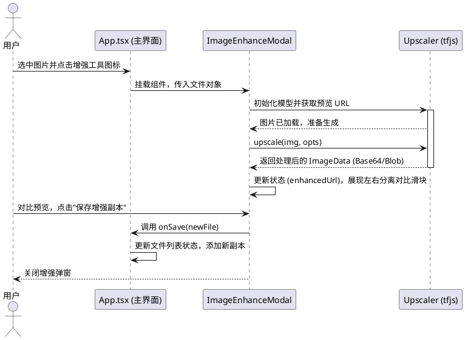

# 技术与实现文档

本文档聚焦系统的实现结构与关键技术路线，用于说明模块边界、处理链路与主要实现策略。

## 1. 核心状态与共享类型

文件列表状态由 [src/App.tsx](../src/App.tsx) 统一编排，按图片、PDF、Word 三类文件维护状态与选中关系。共享类型下沉到 [src/features/files/types.ts](../src/features/files/types.ts)，使 `AiAssistant`、`FilePreview`、`ImageEnhanceModal`、`PdfEditor` 等组件能够依赖稳定的领域类型，而不必反向依赖 `App.tsx`。

共享文件逻辑集中在 [src/features/files/file-utils.ts](../src/features/files/file-utils.ts)，包括：

1. 文件类型识别与分组
2. 选择切换与全选/反选
3. 排序配置推导、自然排序执行与手动移动
4. 文件重命名与复制
5. Zip 导出时的重名处理

这种划分让 `App.tsx` 主要负责状态编排、界面交互与模态框流程，而可单测的纯逻辑保留在独立模块中。

## 2. 文件交互与工作区行为

### 2.1 拖拽与手动重排

工作区使用 `@hello-pangea/dnd` 实现拖拽排序。`DragDropContext` 与 `Droppable` 提供拖拽上下文，`onDragEnd` 读取源位置与目标位置后，对对应数组执行浅拷贝与重排，再回写 React 状态。

除拖拽外，文件列表还提供“上移 / 下移”按钮。它们通过 [src/features/files/file-utils.ts](../src/features/files/file-utils.ts) 中的纯函数交换相邻元素，并在人工重排后清空该分组的排序配置。

### 2.2 排序、命名与复制

名称排序通过 `Intl.Collator(..., { numeric: true })` 实现自然排序，使 `file2.pdf` 排在 `file10.pdf` 之前。区头的 `NAME / DATE / SIZE` 采用排序胶囊按钮形式，用于展示激活状态、排序方向与可交互性。

文件复制不依赖服务端。系统直接复制 `File` 的二进制内容，生成新的 `id` 与名称后插入列表。重命名、复制、预览、删除等常用操作以行内图标形式呈现，便于连续处理文件。

### 2.3 批量转换进度卡片

图片与 Word 的批量转 PDF 流程都在 [src/App.tsx](../src/App.tsx) 中顺序执行，并维护局部进度状态：已完成数量、总数量、当前文件名与任务开始时间。`ImageFilesSection` 与 `WordFilesSection` 通过共享的 [src/features/files/components/ConversionProgressCard.tsx](../src/features/files/components/ConversionProgressCard.tsx) 渲染统一的进度卡片，显示环形百分比、横向进度条、`x/y` 数字反馈与当前处理文件名。

Word 转 PDF 的进度卡片额外显示已用时长与正在使用的转换方式，便于用户理解导出链路与任务推进状态。

## 3. 首页结构与加载策略

首页入口由 [src/App.tsx](../src/App.tsx) 与 [src/components/HomeHero.tsx](../src/components/HomeHero.tsx) 共同实现，结构分为三层：

1. 顶部 Hero：展示产品价值说明与 `Local-first by default`、`AI only when configured` 状态标签。
2. `Workspace Upload` 面板：提供单一上传入口，复用 `fileInputRef`、`handleFileInput()` 与 `processFiles()` 这一套上传逻辑。
3. capability strip：用 PDF、Image、Word 三条 workflow 概括主要能力。

上传区域使用隐藏 `input[type=file]` 与明确的 `Choose files` 按钮触发文件选择，同时保留拖拽导入行为。首页样式 token 集中在 [src/index.css](../src/index.css) 中，统一控制背景、边框、阴影、标题色与按钮强调色。

前端构建采用按需加载。`PdfEditor`、`AiAssistant`、`ImageEnhanceModal`、`FilePreview` 通过 `React.lazy()` 独立拆包；`pdf-lib`、`jszip`、`mammoth`、`browser-image-compression` 等依赖通过 `import()` 在运行时加载。Vite 在 [vite.config.ts](../vite.config.ts) 中为 `pdf-lib`、`pdfjs-dist`、`mammoth`、`html2canvas`、`@tensorflow/*`、`upscaler` 等重量级依赖配置 `manualChunks`，以控制首屏包体积与功能块边界。

## 4. Word 转 PDF 实现路线

### 4.1 质量优先的后端顺序

Word 转 PDF 采用如下质量优先顺序：

1. `local Microsoft Word`
2. `LibreOffice CLI`
3. `browser HTML fallback`

`Microsoft Word 原生导出` 通过 Word COM / `ExportAsFixedFormat` 调用本地 Word，适合最高保真输出；`LibreOffice CLI` 通过 `soffice --headless --convert-to pdf` 执行本地命令行导出；`browser HTML fallback` 通过 HTML 渲染链路生成 PDF，用于无本地 Office 依赖的场景。Python 包装方案如 `docx2pdf`、`pywin32`、UNO / `unoconv` 本质上仍是对 Word 或 LibreOffice 的调用，不作为独立渲染引擎。

### 4.2 旧版 `.doc` 文档处理

`mammoth` 的能力边界是 `DOCX -> HTML`，因此旧版二进制 `.doc` 通过格式分流处理：

1. `.docx` 在浏览器中调用 `mammoth.convertToHtml()`。
2. `.doc` 上传到 `/api/word/extract-html`，由 [src/server/word-conversion.ts](../src/server/word-conversion.ts) 使用 `word-extractor` 提取正文、页眉页脚、脚注、批注与文本框中的可读文本。
3. 服务端对提取内容做 HTML 转义与结构化包装，再回传前端进入浏览器端 PDF 生成链路。

### 4.3 浏览器 HTML 导出路径

浏览器端 HTML 导出使用 [src/features/files/word-pdf.ts](../src/features/files/word-pdf.ts) 中的隐藏宿主模型：

1. 外层 `host` 负责承载不可见、不可交互的转换容器。
2. 真正传给 `html2pdf` 的 `source` 节点保持在普通文档流中。
3. 转换完成后立即清理宿主节点。

这种结构保证了本地渲染过程中的布局稳定性，并便于浏览器端 PDF 生成链路复用。

## 5. 图像增强实现

图像增强由 [src/components/ImageEnhanceModal.tsx](../src/components/ImageEnhanceModal.tsx) 驱动，基于 `@tensorflow/tfjs` 与 `upscaler` 在浏览器中执行端侧推理。核心步骤如下：

1. 初始化或复用 `Upscaler` 实例，并加载模型权重。
2. 使用 `patchSize: 64` 与 `padding: 2` 执行切片放大，降低全图推理导致的 WebGL 上下文丢失风险。
3. 生成增强结果的 `Blob URL`，并通过对比滑块展示原图与增强图。

图像增强结果由主界面接收并作为新文件副本加入工作区。

[查看图像强化时序图源码](./puml/sequence-image-enhance.puml)

## 6. AI 助手与本地 OCR

系统将“AI 助手对话”和“图片 OCR”拆分为两条独立能力链：

1. AI 助手使用 provider 无感知的服务端 gateway。
2. 图片 OCR 使用本地 PaddleOCR runtime。

前端统一通过 [src/lib/ai.ts](../src/lib/ai.ts) 与本地接口通信：AI 助手调用 `/api/ai/chat`，图片 OCR 调用 `/api/ocr/image`。浏览器只接收运行时摘要与结果，不直接接触第三方 API key。

### 6.1 AI 助手 provider 顺序

AI 助手默认支持三类 provider，并按固定顺序尝试：

1. `Gemini`
2. `OpenAI / ChatGPT`
3. `DeepSeek`

只要在 `.env` 或云平台环境变量中配置 `GEMINI_API_KEY`、`OPENAI_API_KEY`、`DEEPSEEK_API_KEY` 中的一个或多个，服务端就会按顺序选择首个可用 provider。Gemini 直接处理多模态文件输入；OpenAI / DeepSeek 侧会在服务端将 PDF 抽取为文本、将图片转为 data URL，并统一拼装对话上下文。

### 6.2 本地 PaddleOCR runtime

图片 OCR 通过以下模块组成：

1. [scripts/bootstrap-local-ocr.mjs](../scripts/bootstrap-local-ocr.mjs)：探测 Python `3.9+`、创建 `.local/paddleocr/venv`、安装 `paddlepaddle` CPU 版与 `paddleocr`、预热离线模型。
2. [src/server/local-ocr.ts](../src/server/local-ocr.ts)：读取 `.local/paddleocr/install-state.json`，把本地 OCR 是否可用的摘要并入 `/api/runtime-config`，并在 OCR 请求到来时将图片负载交给 Python runner。
3. [scripts/local-ocr/ocr_runner.py](../scripts/local-ocr/ocr_runner.py)：接收图片、调用 PaddleOCR，并将识别结果返回给 Node。
4. [scripts/local-ocr/warmup.py](../scripts/local-ocr/warmup.py)：初始化 PaddleOCR 并触发一次最小推理，用于安装期模型预热。

这种设计使图片 OCR 能够在本地离线运行，并与云端 AI key、网络连通性和上游视觉模型权限解耦。

## 7. 服务端模块边界

服务端模块围绕 `server.ts` 展开，并按职责拆分：

1. [src/server/runtime-config.ts](../src/server/runtime-config.ts)：读取 AI provider 与本地 OCR runtime 的运行时摘要。
2. [src/server/ai.ts](../src/server/ai.ts)：负责 AI provider 顺序尝试、能力判断与对话请求组装。
3. [src/server/local-ocr.ts](../src/server/local-ocr.ts)：负责本地 OCR 状态探测与图片 OCR 调度。
4. [src/server/compression.ts](../src/server/compression.ts)：负责 PDF 压缩等级映射、任务 ID 生成与 Ghostscript 命令拼装。
5. [src/server/word-conversion.ts](../src/server/word-conversion.ts)：负责旧版 `.doc` 文本提取、HTML 转义与结构化包装。

这种模块划分使 `server.ts` 主要承担路由与请求流转职责，而可预测、可复用的纯逻辑则通过独立模块与自动化测试进行验证。
