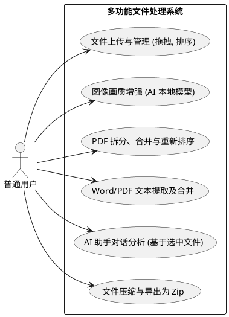

# 需求分析文档

本系统致力于构建一个注重本地隐私与高性能的全平台 Web 文档处理与聚合工具。以下需求经过详细评估。

## 用户角色
- **普通用户（终端使用者）：** 能够在无需安装任何桌面端应用程序的前提下，实现复杂的文档操作（图像调整与放大、PDF 操作、Word 合并与压缩），以及调用 AI 能力。

## 功能需求

1. **统一工作台与跨文件管理机制**：支持本地选择多类型文件，具有文件可视化缩略卡片，以及使用拖拽 (`@hello-pangea/dnd`) 对多文件进行自定义组织和跨类型多选的能力。支持按属性本地排序（日期/大小/字母名称）。
2. **高级图片处理**：
   - 基础操作：调整格式、压缩质量、翻转、本地克隆。
   - 高级扩展（AI Upscaler）：基于 TensorFlow.js（浏览器端）对较低画质图片予以生成式补充及分辨率强化，提供“原图-效果图”滑动交互。
3. **PDF 文档深度编辑**：
   - 解析 PDF 基础信息与分页逻辑。
   - 删除或者抽取原文件的指定页面生成新的副本；合并多份异构文件。
4. **办公文本分析**：
   - 可对 docx 或者 pdf 等进行文本抽取与结构保留。
   - [可选] 将各类图文重组转换。
   - 对于 Word 转 PDF，优先级应以“转换质量第一，稳定性第二，性能第三”为准：有本地 Microsoft Word 时优先使用原生导出；否则使用 LibreOffice CLI；最后才退到浏览器 HTML fallback。Python 包装方案不视为新的独立导出引擎。
5. **集成式 AI 对话助手**：
   - 能够基于上述步骤产生的纯文本结果和图文流，利用可配置的云端 LLM provider（如 Gemini、OpenAI / ChatGPT、DeepSeek）进行连贯的问答与总结交互。
6. **多文件归档与打包下载**：在用户操作完毕后，能对最终产物执行 Zip 通用压缩处理，减少零散下载。

## 非功能需求

1. **隐私与安全保护**：图像增强算法和文档拆分合并**必须**全程在浏览器前台运行（依托浏览器环境），除了用户明确需要通过已配置的云端 AI provider 生成回答的情况，禁止把用户的个人文件上传到第三方服务器。
2. **性能与容错**：AI 图像增强由于属于计算密集型任务，不能导致主进程的浏览器选项卡卡死、白屏或崩溃。
3. **多平台响应性**：UI 和拖拽交互需要在具备现代化 Web 环境的移动端与桌面端保持一致的访问体验。

## 核心用例图
*使用 PlantUML 生成*

[查看用例图源码](./puml/use-cases.puml)

---

*下一步：设计与选型参考请见 [架构设计文档](./architecture.md)*
