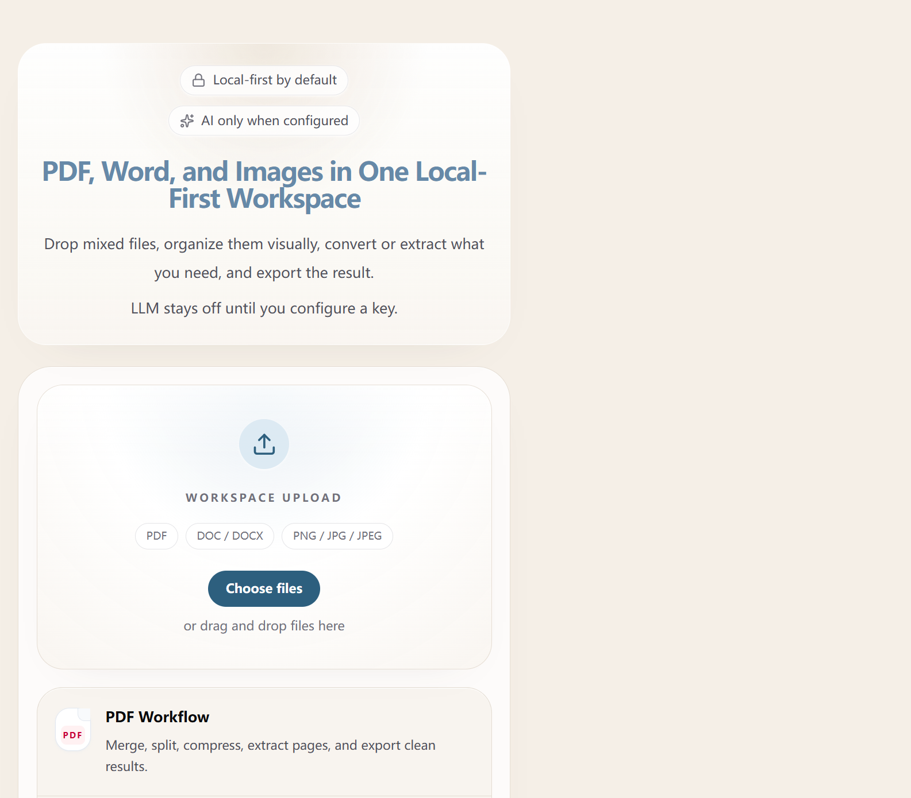

# 用户手册

## 项目简介

欢迎使用**多功能文件处理系统**。本系统提供可视化工作区，用于在浏览器中处理 PDF、图片与 Word 文档，并按需调用本地模型或云端 AI 能力。

系统的核心原则是：**同屏整理、本地优先、按需 AI、统一导出**。大部分文件处理在浏览器或本机服务进程中完成，尽量减少对外部服务的依赖。

为了让后续操作说明更容易对应到界面位置，下面展示首页的初始状态：

首页由三部分组成：顶部 Hero 负责说明 `Local-first by default` 与 `AI only when configured` 这两个产品前提；中段 `Workspace Upload` 面板承接文件导入；底部 capability strip 用 PDF、Image、Word 三条 workflow 概括后续能力。后文提到的首页说明、上传入口和功能区位置，都以这张首页初始状态图为参照。

## 核心功能指南

首页使用工作台入口结构：Hero 负责产品说明，`Workspace Upload` 面板提供文件导入，capability strip 概括三类工作流。上传入口支持 `PDF`、`DOC / DOCX`、`PNG / JPG / JPEG` 三类格式，并通过 `Choose files` 按钮与拖拽提示引导用户进入工作区。

### 1. 文件导入、分类与操作
- **导入文件**：拖拽文件到上传区域，或点击上传按钮。系统会自动将文件分配到图片、PDF、Word 三个栏目。
- **排序与拖拽**：每个分组都提供名称、日期、大小排序按钮；名称排序采用自然排序，例如 `file2.pdf` 排在 `file10.pdf` 之前。列表同时支持拖拽重排。
- **行内顺序微调**：文件条目提供“上移”和“下移”按钮，适合精细调整顺序。手动调整后，该分组按人工顺序展示。
- **通用操作**：文件名右侧提供重命名、复制、预览、删除等常用入口，便于在工作区内连续处理文件。

### 2. Word 转 PDF（含 `.doc`）
- Word 转 PDF 采用质量优先顺序：`本地 Microsoft Word 原生导出 -> LibreOffice CLI -> 浏览器 HTML fallback`。
- `DOCX` 文档优先使用本机 Microsoft Word 或 LibreOffice 导出；当本地 Office 工具不可用时，系统使用浏览器 HTML 渲染链路生成 PDF。
- 旧版 `.doc` 文档通过本地服务端文本提取链路转换为 HTML，再参与 PDF 导出，因此不依赖云端转换服务。
- 批量 Word 转 PDF 时，Word 区块会显示进度卡片，包含百分比、进度条、`已完成/总数`、当前文件名、已用时长，以及正在使用的转换方式。
- 导出流程使用隐藏宿主容器承载 HTML 内容，使浏览器端 PDF 生成过程保持稳定布局。
- 如果需要最高保真度，请优先确保本机安装并可调用 Microsoft Word；如需跨平台自动化，可安装 LibreOffice。

### 3. 图像增强（AI Upscaler）
- 在图片条目上点击增强图标，会打开 **[AI 图像增强窗口](./implementation.md#ai-image-enhancement)**。
- 系统会在本地加载模型并进行超分辨率推理。处理耗时与图片尺寸、设备性能有关。
- 处理完成后，可以通过中间滑块对比原图与增强结果，并将增强后的图片保存为独立副本。

### 4. PDF 拆分、合并与编辑
- 点击 PDF 文件的“编辑”图标进入 PDF 工作台。
- 工作台支持删除页面、抽取页面、组合文件等操作。
- PDF 编辑功能由本地 [PDF-lib](./architecture.md#frontend-tech) 完成，不依赖外部在线工具。

### 5. AI 助手（AI Chat）
- 勾选任意文件后，点击右下角悬浮入口或工具栏中的 **AI 助手**。
- 助手可以围绕选中文件执行总结、翻译、问答与分析。
- 在本地开发环境中启用 AI 助手时，需要在项目根目录的 `.env` 中配置至少一个 key：`GEMINI_API_KEY`、`OPENAI_API_KEY`、`DEEPSEEK_API_KEY`。获取入口分别为 Google AI Studio <https://aistudio.google.com/app/apikey>、OpenAI Platform <https://platform.openai.com/api-keys>、DeepSeek Platform <https://platform.deepseek.com/api_keys>。
- 如果同时配置多个 key，系统按 `Gemini -> OpenAI / ChatGPT -> DeepSeek` 的顺序自动选择首个可用 provider。
- 开发服务器运行后新增 `.env` 时，刷新页面或重新打开 AI 助手即可触发新的运行时配置探测。
- 如果 AI 助手报错，可根据界面提示区分密钥、网络、模型权限或配额问题。

### 6. 图片文字提取（本地 PaddleOCR）
- 在图片条目上点击“扫描文字”按钮，系统会把图片中的文本提取为 Markdown 文件并下载到本地。
- 图片 OCR 通过本地 PaddleOCR runtime 执行，不依赖 `GEMINI_API_KEY`、`OPENAI_API_KEY`、`DEEPSEEK_API_KEY`。
- `npm install` 会自动执行本地 OCR bootstrap：创建项目内 Python 虚拟环境、安装 PaddlePaddle / PaddleOCR，并预热离线模型。安装完成后，图片 OCR 可以在断网状态下使用。
- 如果本机缺少 Python `3.9+`，或 OCR bootstrap 未完成，可补齐环境后重跑 `npm run setup:ocr`。
- OCR 失败提示会区分运行时未就绪、OCR runner 启动异常或识别过程异常，便于定位问题。

### 7. 图片批量转 PDF
- 选择多张图片并点击 **Convert to PDF** 后，图片区块底部会显示进度卡片。
- 进度卡片展示百分比、进度条、`已完成/总数` 数字与当前文件名，方便确认任务推进状态。
- 若某张图片转换失败，界面会提示对应的文件名与错误原因。

### 8. 打包下载
- 勾选所需文件后点击 **导出选中的内容 (Zip)**，系统会将结果归档为一个 ZIP 文件并下载到本地。

---

*如需了解设计目标，请参考 [需求分析文档](./requirements.md)。如需了解实现细节，请参考 [技术与实现文档](./implementation.md)。*
